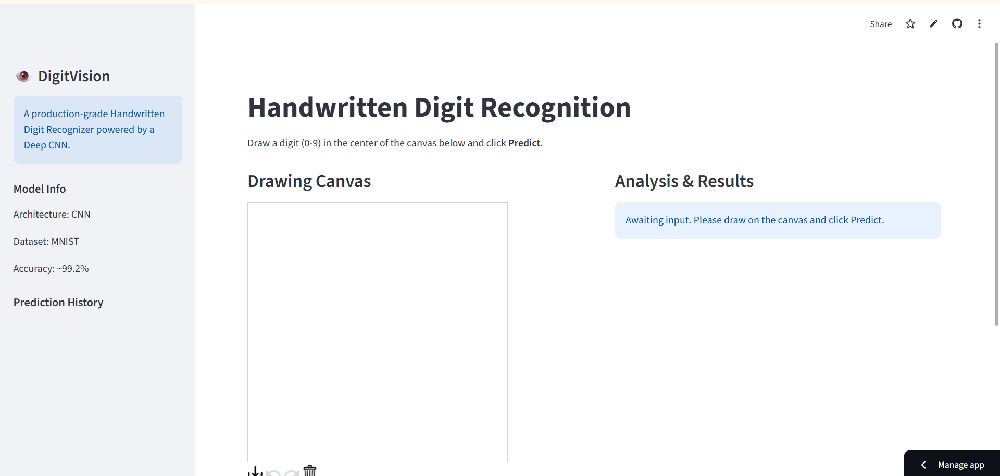
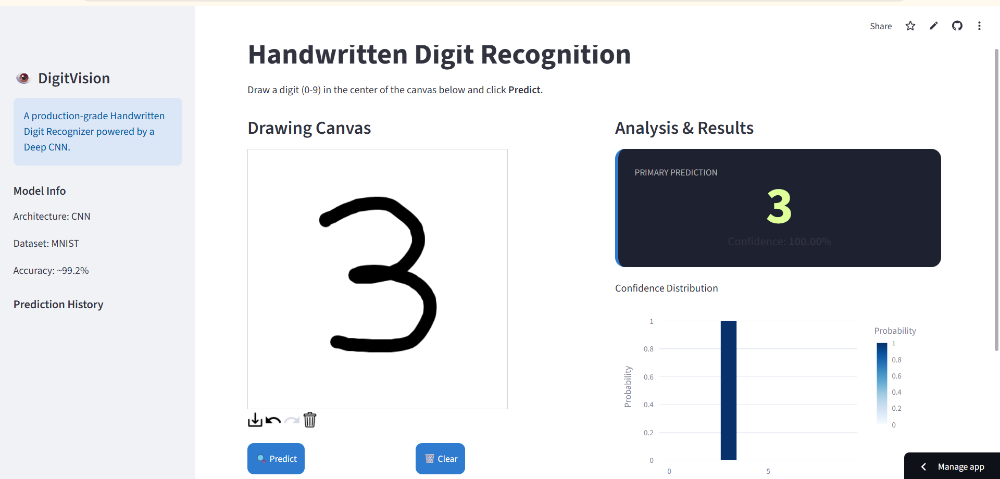
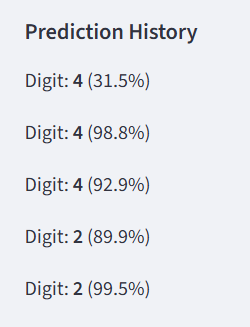

<div align="center">

# 🔢🧠 DigitVision AI
### Real-Time Handwritten Digit Recognition powered by Deep Learning

<p>
  
  
  
  
  
</p>

</div>

---

## 🚀 Live Demo

> **Try the application right now — no installation required.**

🔗 **Live App:** [digitvision-shu-bham.streamlit.app](https://digitvision-zyvla9kbj8n4mu7ktl7v2u.streamlit.app/)

📦 **Repository:** [github.com/shubhampurohit160-cyber/digitvision](https://github.com/shubhampurohit160-cyber/digitvision)

---

## 🖼️ Screenshots

| Home | Prediction | History |
|:---:|:---:|:---:|
|  |  |  |

---

## 📖 Overview

Reading handwritten input is something the human brain does almost effortlessly — but teaching a machine to do the same reliably, in real time, and through a clean interactive interface is a different challenge entirely.

**DigitVision AI** is an interactive web application that recognizes handwritten digits (0–9) as a user draws them on screen. Instead of relying on static image uploads, the app captures input live from a drawing canvas, processes it through a trained Convolutional Neural Network, and returns a prediction along with a transparent breakdown of the model's confidence — all within a lightweight, responsive Streamlit interface.

The project was built to demonstrate a complete, production-style machine learning workflow: from model design and training, to preprocessing pipelines, to a deployed, user-facing application — not just a notebook experiment.

---

## ✨ Features

- 🖊️ **Interactive Drawing Canvas** — draw digits directly in the browser
- ⚡ **Real-Time AI Prediction** — instant inference as soon as a digit is submitted
- 🎯 **Confidence Score** — see how certain the model is about its prediction
- 🥉 **Top-3 Predictions** — view the model's next-best guesses, not just the top result
- 📊 **Probability Visualization** — interactive charts showing the full prediction distribution
- 🕘 **Prediction History** — track and review previous predictions in-session
- 📱 **Responsive Streamlit UI** — clean, accessible design across screen sizes
- 🧩 **Modular Architecture** — separated concerns for model, preprocessing, and UI logic
- 🧩 **Active Learning Feedback Loop:** Includes a user correction UI that saves edge-case misclassifications directly to the server for batch retraining.

---

## 🔄 Demo Workflow

```
   User draws digit
          │
          ▼
   Image preprocessing
          │
          ▼
     CNN inference
          │
          ▼
       Prediction
          │
          ▼
  Confidence visualization
```

Each stage is handled by a distinct module, keeping the pipeline easy to follow, test, and extend.

---

## 🧠 Model Architecture

The core of DigitVision AI is a **Convolutional Neural Network (CNN)** — the standard architecture of choice for image-based classification tasks, and particularly well suited to handwritten digit recognition because it can learn spatial features (edges, curves, strokes) directly from pixel data without manual feature engineering.

**Key architectural components:**

| Layer Type | Purpose |
|---|---|
| 🔲 **Convolution** | Extracts spatial features such as edges, curves, and strokes from the input image |
| 📉 **Max Pooling** | Downsamples feature maps, reducing dimensionality while preserving dominant features |
| 🎲 **Dropout** | Randomly deactivates neurons during training to reduce overfitting |
| 🔗 **Dense Layers** | Combines extracted features to learn higher-level representations |
| 🎯 **Softmax** | Converts final outputs into a probability distribution across the 10 digit classes |

**Why CNNs work well here:** handwritten digits vary in stroke thickness, slant, and position, but the shapes that define each digit are inherently spatial and local. Convolutional layers are translation-invariant and share weights across the image, allowing the network to recognize a "7" or a "3" regardless of exactly where or how it's drawn — with far fewer parameters than a fully-connected network would require.

---

## 📁 Folder Structure

```
digitvision/
├── app
|   └──app.py                  # Streamlit application entry point
|
├──models
|   └──digitvision_model.keras # trained model
|
├── src/
|   ├── train.py             # Model training scrip
|   ├──feedback.py        # feedback from users about incorrect predictions
|   ├──model.py           # CNN architecture definition
│   ├──preprocessing.py      # Image preprocessing pipeline
│   └── visualization.py      # Probability & confidence chart helpers
├── images/
│   ├── home.png
│   ├── predict.png
│   └── history.png
├── requirements.txt
├── LICENSE
└── README.md
```

## 🛠️ Technology Stack

| Category | Technology |
|---|---|
| **Language** | Python |
| **Deep Learning** | TensorFlow, Keras |
| **Web Framework** | Streamlit |
| **Image Processing** | OpenCV, Pillow |
| **Numerical Computing** | NumPy |
| **Visualization** | Plotly |

---

## ⚙️ Installation

**1. Clone the repository**
```bash
git clone https://github.com/shubhampurohit160-cyber/digitvision.git
cd digitvision
```

**2. Create a virtual environment (recommended)**
```bash
python -m venv venv
source venv/bin/activate      # On Windows: venv\Scripts\activate
```

**3. Install dependencies**
```bash
pip install -r requirements.txt
```

---

## ▶️ Usage

**Train the model**
```bash
python model/train.py
```

**Launch the Streamlit app**
```bash
streamlit run app/app.py
```

The app will open automatically in your default browser at `http://localhost:8501`.

---

## 📊 Results

The CNN achieves approximately **99% test accuracy** on the held-out test set.

For every prediction, the app displays the full probability distribution across all 10 digit classes rather than just the top result — giving users visibility into how confident the model actually is, and how close a prediction was to alternative digits.

---

## 🔮 Future Improvements

- 📤 Support for uploaded image input (in addition to canvas drawing)
- 🌗 Dark / Light theme switch
- 🔤 EMNIST support for letter recognition
- 👕 Fashion-MNIST support for apparel classification
- 🔥 Grad-CAM visualization for model interpretability
- ⚖️ Model comparison (e.g., CNN vs. simpler baselines)
- ☁️ Expanded cloud deployment options

---

## 💡 Why This Project Matters

Beyond the model itself, DigitVision AI was built with software engineering discipline in mind:

- **Modular Architecture** — model, preprocessing, and UI logic are cleanly separated into distinct modules
- **Maintainability** — each component can be updated or debugged independently without touching unrelated code
- **Reusability** — preprocessing and visualization utilities are written to be reused across other computer vision projects
- **Separation of Concerns** — training logic, inference logic, and presentation logic do not overlap
- **Scalable Project Structure** — the folder layout is designed to accommodate new models, datasets, or features without requiring a rewrite

This structure reflects an engineering mindset focused on writing production-oriented code, not just achieving a working model in a single script.

---

## 👤 Author

**Shubham Purohit**

[](https://linkedin.com/in/shubham-purohit-920ab0318)
[](https://github.com/shubhampurohit160-cyber)

---

<div align="center">

*If you found this project useful, consider giving it a ⭐ on GitHub.*

</div>
